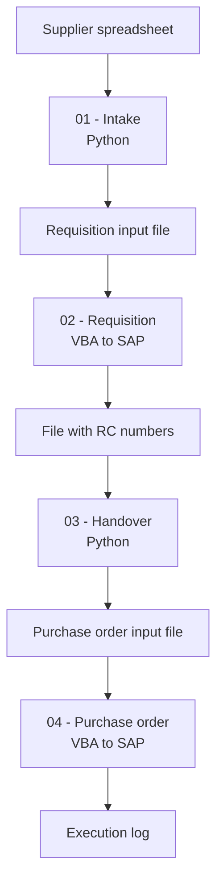

# SAP Purchasing Automation

Automates a purchasing workflow normally handled manually by two teams, from the supplier
spreadsheet all the way to the purchase order created in SAP.


> **About this project**
> Independent project, built from scratch with synthetic data. It recreates a manual purchasing
> process commonly found in manufacturing companies, based on workflows I have worked alongside.
> It contains no employer code, data or system configuration.

---

## The problem

Purchase information arrives from the supplier as a spreadsheet: vendor, part number, gross price,
project code, item description and taxes. From there the process is entirely manual and crosses two
teams.

The administrative purchasing team copies the relevant lines into their own control spreadsheet and
types each item into SAP to create the purchase requisition. SAP returns a requisition number, which
is written back into yet another spreadsheet.

The buyer then picks up that spreadsheet and creates the purchase order in SAP, line by line.

The same data is re-typed three times, lives in disconnected files, and carries no traceability
between the original supplier quote and the final order. Typing errors surface only after the
document exists in SAP, when correcting it is expensive.

## What this project does

| | Manual process | Automated |
|---|---|---|
| Data entry | Re-typed 3 times | Entered once |
| Handover between teams | Copy and paste between files | Generated automatically |
| Requisition number tracking | Manual, in a separate file | Written back automatically |
| Field validation | None, errors found in SAP | Before anything reaches SAP |
| Traceability | Lost between spreadsheets | Full log per line |

## Architecture

The pipeline alternates between two languages by design: **Python handles data transformation, VBA
drives the SAP GUI.** Each tool does what it is best at, and the VBA stages run natively on
locked-down corporate desktops where installing Python is often not an option.



**01 - Intake (Python).** Reads the spreadsheet sent by the supplier, which arrives in whatever
layout the supplier uses. Normalizes the columns, validates the required fields and the data types,
and writes the standardized file the requisition stage expects.

**02 - Requisition (VBA).** Reads the standardized file and creates each purchase requisition in SAP
through GUI scripting. The requisition number returned by SAP is written back next to its line, so
the file becomes the record of what was created.

**03 - Handover (Python).** Reads the completed requisition file, applies the pricing and tax rules
and produces the purchase order input file in the exact layout the buyer's stage expects. This is
the handover that used to be done by copy and paste between teams.

**04 - Purchase order (VBA).** Reads the prepared file and creates the purchase order in SAP,
logging every line as created, skipped or failed, with the reason.

## Input data model

The pipeline works on flat spreadsheets. Sample files with synthetic data are included in each stage.

| Field | Type | Notes |
|---|---|---|
| `vendor_name` | text | required |
| `part_number` | text | required |
| `item_description` | text | required |
| `gross_price` | decimal | required, must be positive |
| `tax_code` | text | required |
| `project_code` | text | required, cost assignment |
| `quantity` | integer | required |
| `requisition_number` | text | written back by stage 02 |
| `purchase_order_number` | text | written back by stage 04 |

## Repository structure

```
sap-automation/
├── 01-supplier-intake/      # Python: supplier file -> standardized file
│   ├── src/
│   └── sample_data/
├── 02-requisition-sap/      # VBA: standardized file -> SAP, returns RC numbers
│   ├── src/
│   └── sample_data/
├── 03-requisition-to-po/    # Python: RC file -> purchase order file
│   ├── src/
│   └── sample_data/
├── 04-purchase-order-sap/   # VBA: PO file -> SAP purchase order
│   ├── src/
│   └── sample_data/
├── shared/                  # validation rules, field mapping, logging
├── requirements.txt
└── .gitignore
```

## Getting started

### Requirements

- Python 3.11 or newer (stages 01 and 03)
- Microsoft Excel with macros enabled (stages 02 and 04)
- SAP GUI for Windows with scripting enabled (stages 02 and 04)

### Setup

```bash
git clone https://github.com/lucasnunesf/sap-automation.git
cd sap-automation
pip install -r requirements.txt
```

### Running the Python stages

Stages 01 and 03 need no SAP connection, so they run standalone against the sample data:

```bash
python 01-supplier-intake/src/intake.py --input 01-supplier-intake/sample_data/supplier_file.xlsx
python 03-requisition-to-po/src/handover.py --input 03-requisition-to-po/sample_data/requisitions.xlsx
```

### Running the VBA stages

The `.bas` modules are imported into an Excel workbook through the VBA editor. They require an
active SAP session and are meant to run against a test environment.

## Tech stack

Python (pandas, openpyxl), VBA, SAP GUI Scripting, Excel.

## Roadmap

- [ ] Replace the file handover between stages with a database table
- [ ] Unit tests for the validation layer
- [ ] Run summary report with created, skipped and failed lines
- [ ] Configurable field mapping, so supplier layouts are not hardcoded

## Author

**Lucas Fernandes Nunes** - Data & BI Analyst
[LinkedIn](https://linkedin.com/in/lucas-fernandes-nunes-335867256) · [Portfolio](https://lucasdata.notion.site)
