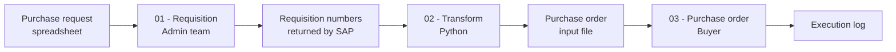

# SAP Purchasing Automation

Automates a purchasing workflow that is normally handled manually by two separate teams: requisition creation, data handover between teams, and purchase order creation in SAP.


> **About this project**
> Independent project, built from scratch with synthetic data. It recreates a manual purchasing
> process commonly found in manufacturing companies, based on workflows I have worked alongside.
> It contains no employer code, data or system configuration.

---

## The problem

Purchase information arrives as a spreadsheet: vendor, part number, gross price, project code, item
description and taxes. From there, the process is entirely manual and passes through two teams.

The administrative purchasing team copies the relevant lines into their own control spreadsheet and
types each item into SAP to create the purchase requisition. SAP returns a requisition number, which
is written back into yet another spreadsheet.

The buyer then picks up that second spreadsheet and creates the purchase order in SAP, line by line.

The same data is therefore re-typed three times, lives in three disconnected spreadsheets, and
carries no traceability between the original request and the final order. Typing errors surface only
after the document exists in SAP, when correcting it is expensive.

## What this project does

| | Manual process | Automated |
|---|---|---|
| Data entry | Re-typed 3 times | Entered once |
| Handover between teams | Copy and paste between files | Generated automatically |
| Requisition number tracking | Manual, in a separate file | Written back automatically |
| Field validation | None, errors found in SAP | Before anything reaches SAP |
| Traceability | Lost between spreadsheets | Full log per line |

## How it works



**Stage 1 - Requisition.** Reads the request spreadsheet, validates the required fields and creates
the requisition in SAP through GUI scripting. The requisition number returned by SAP is written back
next to each line, so the source file becomes the single record of what was created.

**Stage 2 - Transform.** Python reads the completed requisition file, normalizes the fields, applies
the tax and pricing rules and produces the input file the buyer needs, in the exact layout the next
stage expects. This is the handover that used to be done by copy and paste.

**Stage 3 - Purchase order.** Reads the prepared file and creates the purchase order in SAP, logging
every line as created, skipped or failed, with the reason.

## Input data model

The pipeline works on a flat spreadsheet. Sample files with synthetic data are included.

| Field | Type | Notes |
|---|---|---|
| `vendor_name` | text | required |
| `part_number` | text | required, validated against the item list |
| `item_description` | text | required |
| `gross_price` | decimal | required, must be positive |
| `tax_code` | text | required |
| `project_code` | text | required, cost assignment |
| `quantity` | integer | required |
| `requisition_number` | text | written back by stage 1 |

## Repository structure

```
sap-automation/
├── 01-requisition/        # spreadsheet -> SAP, writes requisition numbers back
│   ├── src/
│   └── sample_data/
├── 02-transform/          # Python: requisition file -> purchase order file
│   ├── src/
│   └── sample_data/
├── 03-purchase-order/     # prepared file -> SAP purchase order
│   ├── src/
│   └── sample_data/
├── shared/                # SAP session handling, Excel reader, validation, logging
├── docs/
├── requirements.txt
└── .gitignore
```

## Getting started

### Requirements

- Python 3.11 or newer
- Microsoft Excel
- SAP GUI for Windows with scripting enabled (only for stages 1 and 3)

### Setup

```bash
git clone https://github.com/lucasnunesf/sap-automation.git
cd sap-automation
pip install -r requirements.txt
```

### Running the transformation stage

Stage 2 runs standalone and needs no SAP connection, so it can be executed against the sample data:

```bash
python 02-transform/src/transform.py --input 02-transform/sample_data/requisitions.xlsx
```

Stages 1 and 3 require an active SAP session and are meant to run against a test environment.

## Tech stack

Python (pandas, openpyxl, pywin32), VBA, SAP GUI Scripting, Excel.

## Roadmap

- [ ] Replace the spreadsheet handover with a database table
- [ ] Unit tests for the validation layer
- [ ] Run summary report with created, skipped and failed lines
- [ ] Configurable field mapping, so the layout is not hardcoded

## Author

**Lucas Fernandes Nunes** - Data & BI Analyst
[LinkedIn](https://linkedin.com/in/lucas-fernandes-nunes-335867256) · [Portfolio](https://lucasdata.notion.site)
