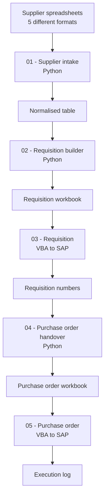

# SAP Purchasing Automation

Automates a purchasing workflow normally handled manually by two teams, from the supplier
spreadsheet all the way to the purchase order created in SAP.


> **About this project**
> Independent project, built from scratch with synthetic data. It recreates a manual purchasing
> process commonly found in manufacturing companies, based on workflows I have worked alongside.
> It contains no employer code, data or system configuration.

---

## The problem

Purchase information arrives from the supplier as a spreadsheet: vendor, part number, gross price,
project code, item description and taxes. Every supplier sends it in their own format, and none of
them will change that format for a single customer.

From there the process is entirely manual and crosses two teams. The administrative purchasing team
copies the relevant lines into their own control spreadsheet and types each item into SAP to create
the purchase requisition. SAP returns a requisition number, which is written back into yet another
spreadsheet. The buyer then picks up that spreadsheet and creates the purchase order in SAP, line
by line.

The same data is re-typed three times, lives in disconnected files, and carries no traceability
between the original supplier quote and the final order. Typing errors surface only after the
document exists in SAP, when correcting it is expensive.

## What this project does

| | Manual process | Automated |
|---|---|---|
| Data entry | Re-typed 3 times | Entered once |
| Handover between teams | Copy and paste between files | Generated automatically |
| Requisition number tracking | Manual, in a separate file | Written back automatically |
| Field validation | None, errors found in SAP | Before anything reaches SAP |
| Traceability | Lost between spreadsheets | Every line carries its source file and row |

## Architecture

Five stages, alternating between two languages by design: **Python handles data transformation,
VBA drives the SAP GUI.** The VBA stages run natively on locked-down corporate desktops where
installing Python is often not an option.



Each stage owns one kind of knowledge, so a change stays inside one stage.

**01 - Supplier intake (Python).** Reads each supplier quotation according to a mapping entry and
produces one normalised table. Knows about supplier layouts and nothing else. A supplier changing
their spreadsheet affects only this stage.

**02 - Requisition builder (Python).** Enriches the normalised table from the item master, works
out the value SAP expects, and fills the requisition workbook. Knows the internal side of the
process. The requisition form changing affects only this stage.

**03 - Requisition (VBA).** Creates each requisition in SAP through GUI scripting and writes the
number SAP returns back into the workbook.

**04 - Purchase order handover (Python).** Reads the completed requisitions and produces the
purchase order input file, replacing the copy-and-paste handover between the two teams.

**05 - Purchase order (VBA).** Creates the purchase order in SAP, logging every line as created,
skipped or failed, with the reason.

## Adding a supplier without changing code

Supplier layouts live in `shared/suppliers.yaml`, one block per supplier:

```yaml
supplier_2:
  name: Supplier 2
  header_row: 1
  decimal_style: dot
  tax_style: percent_number
  columns:
    part_number: Item Code
    quantity: Quantity
    unit_price: Unit Price
    ipi: IPI Rate (%)
```

Adding a supplier means copying a block and changing the column titles. The same applies to items:
a new part number is a new row in `shared/master_data.xlsx`. Neither requires touching Python.

The five sample files exercise the cases that make this necessary. The same 5% IPI arrives as
`"5%"` text from supplier 1, `5.0` from supplier 2, `0.05` from supplier 3, a currency amount from
supplier 4, and buried inside `"IPI 5%; ICMS 18%"` from supplier 5. Supplier 3 also carries section
headings and subtotal rows inside its data, supplier 4 splits materials and services across two
sheets, and supplier 5 packs quantity, unit and currency into single cells.

## What the pipeline does not do

It never guesses. A missing quantity, a zero price, a duplicated line or an item that is not in the
item master is rejected and reported with its source file, sheet and row:

```
44 lines read
41 normalised
3 rejected

Rejected lines:
  supplier_3.xlsx [QUOTE] row 11: quantity is empty; net amount is zero
  supplier_3.xlsx [QUOTE] row 12: duplicate of row 10
  supplier_3.xlsx [QUOTE] row 13: net amount is zero
```

Layout differences repeat every month and are worth automating. Data errors are one-offs and are
worth reporting, not repairing.

## Repository structure

```
sap-automation/
├── 01-supplier-intake/       # Python: 5 supplier formats -> normalised table
│   ├── src/intake.py
│   └── sample_data/
├── 02-requisition-builder/   # Python: normalised table -> requisition workbook
│   └── src/build_requisition.py
├── 03-requisition-sap/       # VBA: requisition workbook -> SAP, returns numbers
├── 04-po-handover/           # Python: requisitions -> purchase order input
├── 05-purchase-order-sap/    # VBA: purchase order input -> SAP
├── shared/
│   ├── suppliers.yaml        # supplier layout mapping
│   ├── parsers.py            # value parsing helpers
│   ├── master_data.xlsx      # item master
│   └── Input_RC_automatic.xlsx
└── requirements.txt
```

## Getting started

```bash
git clone https://github.com/lucasnunesf/sap-automation.git
cd sap-automation
pip install -r requirements.txt
```

Stages 01 and 02 need no SAP connection and run against the sample data:

```bash
cd 01-supplier-intake/src
python intake.py --input ../sample_data/ --all

cd ../../02-requisition-builder/src
python build_requisition.py --input ../../01-supplier-intake/src/normalised_items.xlsx
```

The VBA stages require an active SAP session with scripting enabled, and are meant to run against a
test environment. The `.bas` modules are imported into an Excel workbook through the VBA editor.

## Tech stack

Python (openpyxl, PyYAML), VBA, SAP GUI Scripting, Excel.

## Roadmap

- [ ] Replace the file handover between stages with a database table
- [ ] Unit tests for the parsing and validation layers
- [ ] Configurable field mapping for the requisition layout as well

## Author

**Lucas Fernandes Nunes** - Data & BI Analyst
[LinkedIn](https://linkedin.com/in/lucas-fernandes-nunes-335867256) · [Portfolio](https://lucasdata.notion.site)
