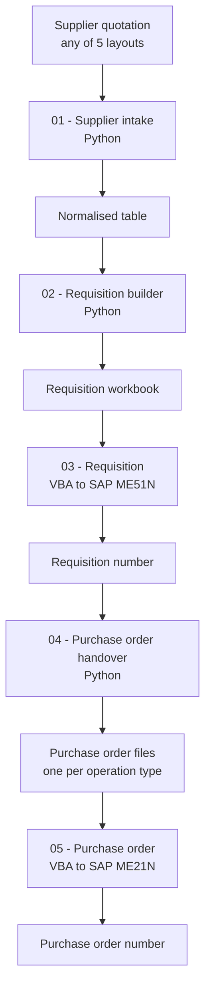

# SAP Purchasing Automation

Automates a purchasing workflow normally handled manually by two teams, from the supplier
quotation all the way to the purchase order created in SAP.


> **About this project**
> Independent project, built from scratch with synthetic data. It recreates a manual purchasing
> process commonly found in manufacturing companies, based on workflows I have worked alongside.
> It contains no employer code, data or system configuration.

---

## The problem

Purchase information arrives from the supplier as a spreadsheet: vendor, part number, gross price,
project code, item description and taxes. Every supplier sends it in their own format, and none of
them will change that format for a single customer.

From there the process is manual and crosses two teams. The administrative team copies the relevant
lines into their own control spreadsheet and types each item into SAP to create the purchase
requisition. SAP returns a requisition number, which is written into yet another spreadsheet. The
buyer then picks up that spreadsheet and creates the purchase order in SAP, line by line.

The same data is re-typed three times, lives in disconnected files, and carries no traceability
between the original quotation and the final order. Typing errors surface only after the document
exists in SAP, when correcting it is expensive.

## What this project does

| | Manual process | Automated |
|---|---|---|
| Data entry | Re-typed 3 times | Entered once |
| Handover between teams | Copy and paste between files | Generated automatically |
| Requisition number tracking | Manual, in a separate file | Written back by the macro |
| Field validation | None, errors found in SAP | Before anything reaches SAP |
| Business rules | Held by whoever does the job | Enforced and reported |
| Traceability | Lost between spreadsheets | Every line carries its source file and row |

## Architecture

Five stages, alternating between two languages by design: **Python transforms data, VBA drives the
SAP GUI.** The VBA stages run natively on locked-down corporate desktops where installing Python is
often not an option.


```mermaid
flowchart TD
    A[Supplier quotation<br/>any of 5 layouts] --> B[01 - Supplier intake<br/>Python]
    B --> C[Normalised table]
    C --> D[02 - Requisition builder<br/>Python]
    D --> E[Requisition workbook]
    E --> F[03 - Requisition<br/>VBA to SAP ME51N]
    F --> G[Requisition number]
    G --> H[04 - Purchase order handover<br/>Python]
    H --> I[Purchase order files<br/>one per operation type]
    I --> J[05 - Purchase order<br/>VBA to SAP ME21N]
    J --> K[Purchase order number]
```

Each stage owns one kind of knowledge, so a change stays inside one stage.

**01 - Supplier intake.** Reads a supplier quotation according to its mapping entry and produces a
normalised table. Knows supplier layouts and nothing else. A supplier changing their spreadsheet
affects only this stage.

**02 - Requisition builder.** Enriches the normalised table from the item master, works out the
value SAP expects, and fills the requisition workbook. Knows the internal side of the process: the
item master, the tooling and service split, and the tax rule.

**03 - Requisition.** Creates the requisition in SAP through GUI scripting and writes the number
SAP returns back into the workbook.

**04 - Purchase order handover.** Reads the completed requisition, joins it back to the supplier
data from stage 01 and produces the purchase order files. This replaces the copy-and-paste handover
between the two teams.

**05 - Purchase order.** Creates the purchase order in SAP by adopting the lines of the
requisitions it references, rather than re-typing items SAP already holds, and writes the order
number back.

## Who runs what

The two halves of the process belong to different people, so each half is self-contained.

| Stage | Run by | Needs |
|---|---|---|
| 01, 02 | Administrative team | Python, the supplier quotation |
| 03 | Administrative team | Excel, SAP, the requisition workbook |
| 04 | Administrative team, once SAP has returned the number | Python |
| 05 | Buyer | Excel, SAP, the purchase order file only |

The buyer receives one file and needs nothing else from the pipeline: supplier, dates, requisition
numbers, quantities and prices all travel inside it. Neither macro depends on Python, a shared
drive, or a network path.

## The business rules the code enforces

Three rules are expressed in code rather than left to whoever happens to be doing the job.

**The requisition value depends on the operation type.** A requisition does not carry tax rates, it
carries the value those rates produce. Tooling takes the net amount plus IPI; service takes it with
all taxes applied. One function, five lines, in stage 02.

**A requisition belongs to one supplier.** Stage 04 checks that every line agrees and refuses to
continue when they do not, naming the suppliers it found. Without that check, a requisition built
from mixed quotations would quietly produce wrong purchase orders.

**A purchase order covers one operation type.** A requisition therefore yields at most two orders,
one for tooling and one for service.

## Adding a supplier without changing code

Supplier layouts live in `shared/suppliers.yaml`, one block per supplier:

```yaml
supplier_2:
  name: Supplier 2
  header_row: 1
  decimal_style: dot
  tax_style: percent_number
  columns:
    part_number: Item Code
    quantity: Quantity
    unit_price: Unit Price
    ipi: IPI Rate (%)
```

Adding a supplier means copying a block and changing the column titles. Where a quotation does not
carry a value at all, a `constants` block supplies it. Items work the same way: a new part number
is a new row in `shared/master_data.xlsx`. Neither requires touching Python.

The five sample files exercise the cases that make this necessary. The same 5% IPI arrives as
`"5%"` text from supplier 1, `5.0` from supplier 2, `0.05` from supplier 3, a currency amount from
supplier 4, and buried inside `"IPI 5%; ICMS 18%"` from supplier 5. Supplier 3 also carries section
headings and subtotal rows inside its data, supplier 4 splits materials and services across two
sheets, and supplier 5 packs quantity, unit and currency into single cells.

## What the pipeline does not do

It never guesses. A missing quantity, a zero price, a duplicated line or an item that is not
registered is rejected and reported with its source file, sheet and row:

```
44 lines read
41 normalised
3 rejected

Rejected lines:
  supplier_3.xlsx [QUOTE] row 11: quantity is empty; net amount is zero
  supplier_3.xlsx [QUOTE] row 12: duplicate of row 10
  supplier_3.xlsx [QUOTE] row 13: net amount is zero
```

Layout differences repeat every month and are worth automating. Data errors are one-offs and are
worth reporting, not repairing.

## Repository structure

```
sap-automation/
├── 01-supplier-intake/
│   ├── src/intake.py              # supplier quotation -> normalised table
│   └── sample_data/               # five formats, same required fields
├── 02-requisition-builder/
│   └── src/build_requisition.py   # normalised table -> requisition workbook
├── 03-requisition-sap/
│   └── src/RequisitionSAP.bas     # requisition workbook -> SAP ME51N
├── 04-po-handover/
│   └── src/po_handover.py         # requisition -> purchase order files
├── 05-purchase-order-sap/
│   └── src/PurchaseOrderSAP.bas   # purchase order file -> SAP ME21N
├── shared/
│   ├── suppliers.yaml             # supplier layout mapping
│   ├── parsers.py                 # value parsing, one place for messy formats
│   ├── item_master.py             # item master access, used by stages 02 and 04
│   ├── master_data.xlsx           # item master
│   ├── Input_RC_automatic.xlsx    # requisition template
│   └── Input_PO_automatic.xlsx    # purchase order template
└── requirements.txt
```

## Getting started

```bash
git clone https://github.com/lucasnunesf/sap-automation.git
cd sap-automation
pip install -r requirements.txt
```

Stages 01, 02 and 04 need no SAP connection and run against the sample data. The pipeline processes
one supplier quotation at a time:

```bash
cd 01-supplier-intake/src
python intake.py --input ../sample_data/supplier_2.xlsx

cd ../../02-requisition-builder/src
python build_requisition.py --input ../../01-supplier-intake/src/normalised_items.xlsx
```

`--input ../sample_data/ --all` reads every sample file in one pass. That is useful for seeing the
five formats normalised together, and stage 04 will then stop and say so, because the result mixes
suppliers.

After stage 03 has written the requisition numbers:

```bash
cd ../../04-po-handover/src
python po_handover.py \
    --requisition ../../02-requisition-builder/src/Input_RC_automatic_filled.xlsx \
    --normalised  ../../01-supplier-intake/src/normalised_items.xlsx
```

### The VBA stages

The `.bas` modules are imported into an Excel workbook through the VBA editor (`Alt + F11`, then
File > Import File). They require an active SAP session with GUI scripting enabled on both client
and server, and are meant to run against a test environment.

The SAP screen paths at the top of each module are release and variant specific. Record them once
in your own system with the SAP GUI script recorder and replace the constants; paths copied from
another installation will not resolve.

## Tech stack

Python (openpyxl, PyYAML), VBA, SAP GUI Scripting, Excel.

## Roadmap

- [ ] Replace the file handover between stages with a database table
- [ ] Unit tests for the parsing and validation layers
- [ ] Move the requisition and purchase order layouts into configuration as well

## Author

**Lucas Fernandes Nunes** - Data & BI Analyst
[LinkedIn](https://linkedin.com/in/lucas-fernandes-nunes-335867256) · [Portfolio](https://lucasdata.notion.site)
